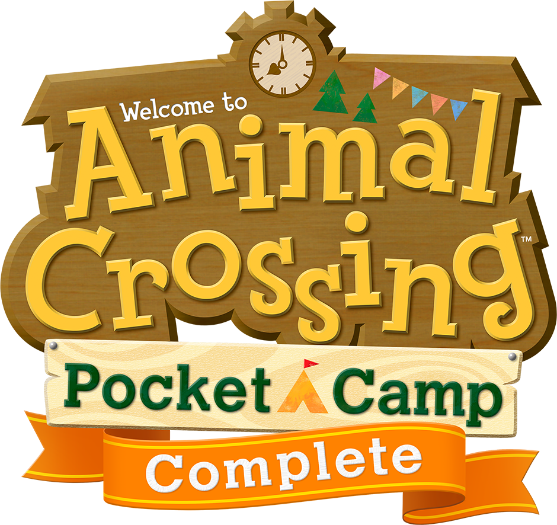

<div align="center">



</div>

<h1 align="center">Animal Crossing: Pocket Camp Complete — Nintendo Switch port</h1>

This is a wrapper/port of the Android arm64 release of **Animal Crossing: Pocket Camp Complete** (v7.1.3).
It loads the original Unity/IL2CPP game binaries, patches them, and runs them natively inside a minimal Android-compatible environment on Nintendo Switch.

### How to install

1. Create `/switch/acpc_nx/` on your SD card.
2. Copy `acpc_nx.nro` into that folder.
3. Extract `libunity.so`, `libmain.so`, `libil2cpp.so`, and `libTone.so` from the game's `lib/arm64-v8a/` directory and copy them into `/switch/acpc_nx/`.

4. Copy the contents of the game's `assets/` directory into `/switch/acpc_nx/assets/`.

Your SD card should contain:

```text
/switch/acpc_nx/
  acpc_nx.nro
  config.txt
  libmain.so
  libunity.so
  libil2cpp.so
  libTone.so
  assets/
```

### Notes

This will not work in Album/applet mode. Use a game override by holding R while launching a title, or use a forwarder.

Normal play does not require a continuously active connection. An internet connection is still required when the game downloads content.

### Controls and configuration

`config.txt` is created beside the NRO on first launch:

- `language 0` follows the Switch system language;
- `portrait 1` rotates clockwise; `2` rotates counterclockwise.

### How to build

You are going to need devkitA64, libnx, and the following devkitPro packages:

- `switch-mesa`
- `switch-libdrm_nouveau`
- `switch-sdl2`
- `switch-zlib`

Install the portlibs and build

### Credits

- **TheOfficialFloW** and **Andy Nguyen** — original Android native-loader work.
- **fgsfds** — Nintendo Switch shared-object loader groundwork.

### Support

If you enjoy my work and want to support me:

[](https://ko-fi.com/D1D1P2MOG)

### Legal

This project has no direct affiliation with Nintendo Co., Ltd. Animal Crossing and Animal Crossing: Pocket Camp Complete are trademarks of their respective owners. All rights reserved.

No assets or program code from the original game are included in this project. We do not condone piracy and encourage users to legally own the original game.

Unless specified otherwise, the source code in this repository is licensed under the MIT License. See the accompanying LICENSE file.
